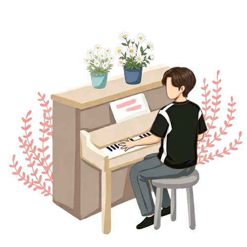

##  Hello!

  <samp>
    My name is <em>WeiMinal</em>. 
     Embodied robotics test engineer by day, indie developer by night.
     I like turning interesting ideas into something real.
  </samp>
     

###  I'm currently learning ...

-  Piano —but still working on getting both hands to play together

###  Ask me about ...

-  UI aesthetics, desk setups, or embodied robotics

###  Tools I work with ...

  
  
  
  

###  Just for fun ...

<picture>
  <source media="(prefers-color-scheme: dark)" srcset="https://raw.githubusercontent.com/WeiMinal/WeiMinal/output/github-contribution-grid-snake-dark.svg">
  <source media="(prefers-color-scheme: light)" srcset="https://raw.githubusercontent.com/WeiMinal/WeiMinal/output/github-contribution-grid-snake.svg">
  
</picture>
